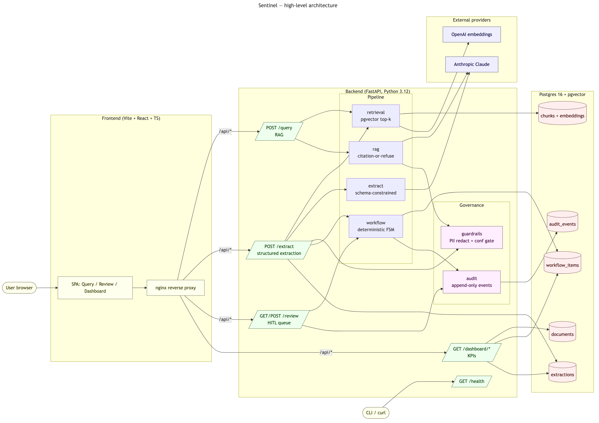
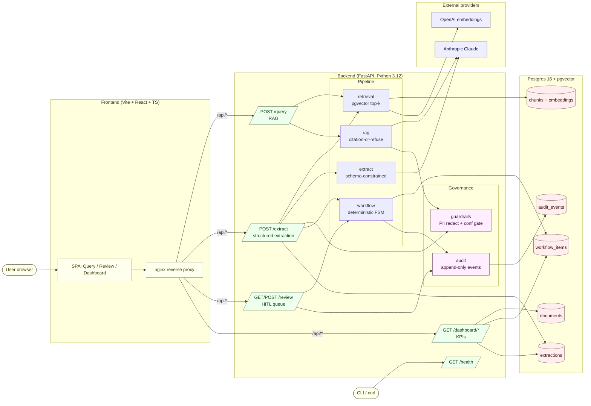
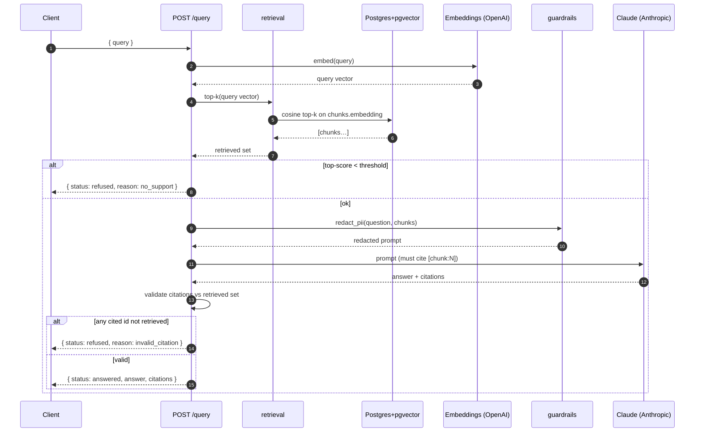
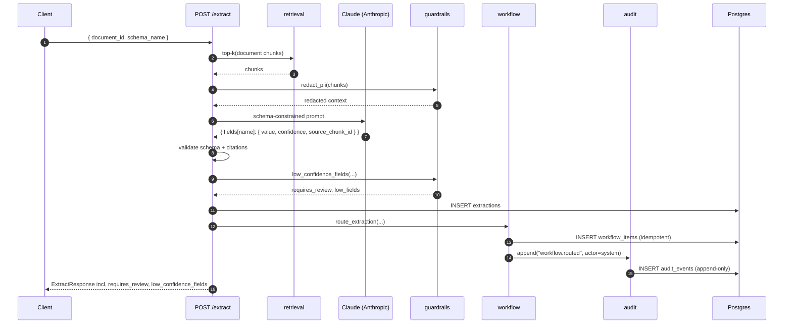
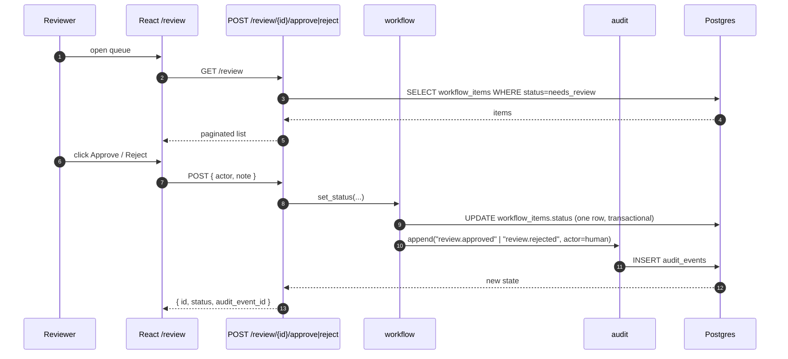
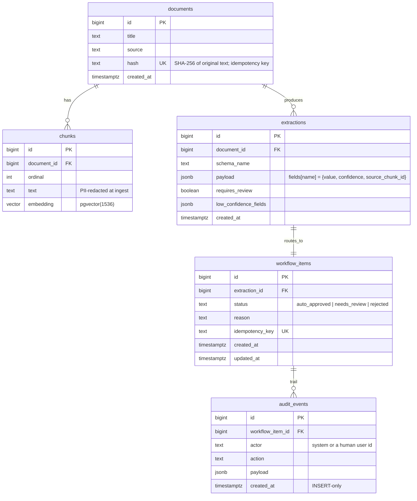
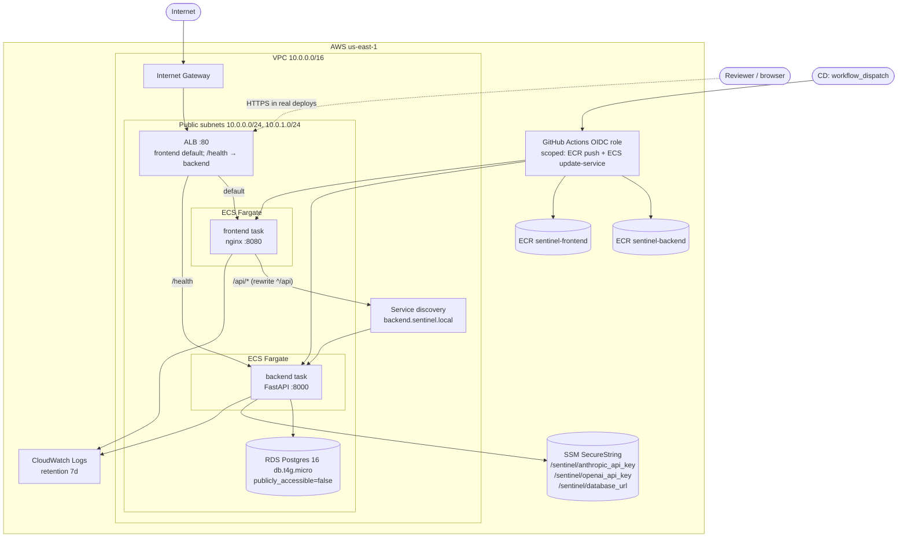

# Architecture

Sentinel is a governed document-intelligence platform. It turns an unstructured
corpus into two outputs — **source-cited natural-language answers** and
**schema-structured records with per-field confidence** — and runs both outputs
through a **deterministic, idempotent, human-in-the-loop workflow** with an
**immutable audit trail**.

This doc is the architectural cross-reference: what the components are, how they
fit together, where the source of truth for each invariant lives, and the
deployment shape from M10.

> All sample data is synthetic. The system is a portfolio project; it is not
> production and has never seen real customer data. See `data/sample/README.md`.

---

## High-level component diagram



Source (regenerate the PNG with `npx -y @mermaid-js/mermaid-cli -i
docs/architecture.mmd -o docs/architecture.png` or render any Mermaid block in
this file):



The two solid invariants that drive this shape:

1. **Citation-or-refuse.** Every answer must be supported by a retrieved chunk.
   `rag.answer_query` requires the LLM to emit `[chunk:N]` markers and refuses
   if any cited id wasn't in the retrieval set.
2. **Append-only audit.** Every model suggestion and every human decision
   writes one row to `audit_events`. The repository layer has no update or
   delete path. Reconstructing any workflow item's state by replay is a tested
   property.

---

## Components and source-of-truth files

### Ingestion (`backend/app/ingest.py`)

Documents → SHA-256 hash → idempotent insert → token-based chunking with
overlap → batched embeddings → bulk insert into `chunks`. The hash check on
`documents.hash` short-circuits a re-ingest of identical content; chunk inserts
use `ON CONFLICT DO NOTHING`. PII redaction runs *before* the chunk store so
the database never sees raw emails / SSNs / phone numbers / IPs.

### Embeddings (`backend/app/embeddings/`)

Provider behind an interface. Two implementations: `OpenAIEmbedder`
(`text-embedding-3-small`, 1536 dims) and `FakeEmbedder` (deterministic SHA-256
projection used in CI and unit tests). Provider is selected by
`EMBEDDINGS_PROVIDER`. CI runs offline with `EMBEDDINGS_PROVIDER=fake`.

### Retrieval (`backend/app/retrieval.py`)

pgvector cosine top-k against `chunks.embedding`. The retrieval set is the
sole grounding signal for the RAG layer above it; the RAG layer cannot answer
without one.

### RAG (`backend/app/rag.py`)

Citation-grounded question answering. Flow:

1. Embed the query.
2. Retrieve top-k chunks.
3. Reject if the top score is below `RAG_SIMILARITY_THRESHOLD` (returns a
   refusal with `reason="no_support"`).
4. Apply pre-LLM PII redaction to the question and the chunk texts.
5. Send a prompt asking for an answer that cites every claim with `[chunk:N]`.
6. Parse the `[chunk:N]` markers; if any cited id is not in the retrieval
   set, return a refusal with `reason="invalid_citation"`. This is the
   citation-validity invariant tested in `test_rag.py`.

### Extraction (`backend/app/extract.py`)

Schema-constrained extraction. The LLM is given a Pydantic schema (e.g.
`InvoicePayload`) and a chunk context; it must emit per-field
`{value, confidence, source_chunk_id}` triples. The result is validated
against the schema, the source-chunk ids are validated against the retrieval
set (same citation-validity rule as RAG), per-field confidences are evaluated
against the review threshold, and the row is persisted to `extractions` with
`requires_review` and `low_confidence_fields` precomputed for the workflow
engine.

### Guardrails (`backend/app/guardrails.py`)

Deterministic safety layer. PII redaction is a registry of named regex
patterns (`EMAIL`, `SSN`, `CREDIT_CARD`, `PHONE`, `IPV4`) replaced with
`[REDACTED:KIND]`. Idempotent: a second pass over redacted output is a no-op.
The `requires_review` / `low_confidence_fields` helpers consume the per-field
confidence map from extraction. See `docs/guardrails.md` for the full
specification.

### Workflow engine (`backend/app/workflow.py`)

Deterministic finite-state machine with three states: `auto_approved`,
`needs_review`, `rejected`. Routing is based purely on
`extraction.requires_review` and the per-field rules; the same extraction
always routes to the same state. **Idempotent:** routing or re-routing the
same extraction never creates a second `workflow_items` row. State changes
emit one audit event each. See `docs/workflow.md` for the state diagram.

### Audit log (`backend/app/audit.py`)

`audit_events` is append-only by construction: the repository exposes only
`append`, never `update` or `delete`. Every workflow transition (model-driven
or human-driven) writes exactly one row containing `actor`, `action`,
`payload`, and a foreign key to the workflow item. Replaying the events for a
workflow item must reproduce its current state — this is asserted in
`test_audit_events_append_only.py`. See `docs/audit-and-review.md`.

### Review API + UI (`backend/app/routers/review.py`, `frontend/src/Review.tsx`)

`GET /review` lists items in the `needs_review` state. `POST /review/{id}/approve`
and `POST /review/{id}/reject` transition the item, write the audit event, and
return the new state in one transaction. The React UI is a paginated queue
with approve/reject actions and an actor field; the typed client in
`frontend/src/api.ts` mirrors the Pydantic shapes and is the only place HTTP
details live.

### Dashboard API (`backend/app/routers/dashboard.py`)

Four read-only KPI endpoints:
- `/dashboard/volume` — daily ingestion counts over the last *N* days.
- `/dashboard/categories` — extractions grouped by schema name.
- `/dashboard/confidence` — histogram of per-field confidence.
- `/dashboard/sla` — count of `needs_review` items older than *N* hours.

The frontend Dashboard route is React-lazy-loaded (perf follow-up #11) so the
Recharts vendor chunk does not block the initial bundle.

### Observability (`backend/app/observability.py`)

`configure_logging()` wires structlog for JSON output (`SENTINEL_LOG_FORMAT=
console` for local dev). `RequestIdMiddleware` assigns a stable id per request
(an inbound `X-Request-Id` is sanitised and accepted; a generated `uuid4().hex`
is used otherwise), binds it to the structlog contextvars for the request
scope, and surfaces it on the response so end-to-end correlation across the
nginx → FastAPI hop is one grep.

### Evaluation harness (`eval/`)

Three evaluators (extraction accuracy, retrieval precision/recall/MRR, RAG
citation-validity / cites-relevant / refusal rate) against a small hand-labeled
synthetic benchmark. The harness emits `n/a (...)` rather than a number when a
fake provider is in play — the n/a gate is what keeps Golden Rule #5 enforced
in code, not just convention. See `docs/evaluation.md` for the methodology
defense.

---

## End-to-end request flows

### `POST /query` — citation-grounded RAG



### `POST /extract` — schema-constrained extraction with HITL routing



### Human review



---

## Data model



The `idempotency_key` on `workflow_items` is what enforces "routing or
re-routing the same extraction never creates a second row." The unique index
on `audit_events` is intentionally absent — order of arrival is the only
constraint and is preserved by `created_at` plus the row's natural id.

---

## Deployment shape (M10)



### Security invariants encoded in security groups

```
internet      ──→ alb_sg          (80, 443)
alb_sg        ──→ frontend_sg     (8080)        ALB → nginx
alb_sg        ──→ backend_sg      (8000)        ALB → FastAPI /health
frontend_sg   ──→ backend_sg      (8000)        nginx /api proxy → FastAPI
backend_sg    ──→ rds_sg          (5432)        FastAPI → Postgres
```

**RDS is not publicly accessible.** `aws_db_instance.publicly_accessible =
false` and the `rds` security group ingress is keyed only to the backend SG.
Even though RDS lives in the same public subnets as the tasks (no private
subnets in the no-NAT design), the SG bars internet reach.

### Cost posture (deliberate, demo-only)

| Resource              | Approx idle cost | Notes                                       |
| --------------------- | ---------------: | ------------------------------------------- |
| ALB                   |          ~$16/mo | Cheapest line item that's still always-on.  |
| 2× Fargate (0.25 vCPU)|          ~$15/mo | 24/7. Stop the services to stop the bill.   |
| RDS db.t4g.micro 20 GB|          ~$13/mo | Single-AZ. ~$2/mo storage + ~$11/mo compute.|
| ECR storage           |           <$1/mo | 20-image cap on each repo.                  |
| CloudWatch Logs       |           <$1/mo | 7-day retention, demo log volume is tiny.   |
| **Total idle floor**  |     **~$45/mo**  | Plus per-second Fargate + traffic charges.  |

The estimate excludes a NAT Gateway (~$32/mo idle) by design: ECS tasks live
in public subnets with `assign_public_ip = true` so they can reach ECR,
Anthropic, OpenAI, and CloudWatch without one. This is acceptable **only**
because the security groups are tight (above) and the deployment is
ephemeral. Run `terraform destroy` immediately after demo screenshots — the
operator recipe lives in `infra/README.md`.

### CD posture

`.github/workflows/cd.yml` is `workflow_dispatch`-only. There is no `push:`
or `pull_request:` trigger. The trigger gate is the cost-control mechanism
for M10; deploys never happen on a code push by accident. The CD job assumes
the OIDC role written by `infra/modules/ci_oidc/`, builds and pushes the
images to ECR, and force-redeploys the ECS services.

---

## Cross-references

| Concern | Where to look |
| --- | --- |
| Workflow state machine | `docs/workflow.md`, `backend/app/workflow.py` |
| Audit invariants | `docs/audit-and-review.md`, `backend/app/audit.py` |
| Guardrails (PII + confidence) | `docs/guardrails.md`, `backend/app/guardrails.py` |
| Eval methodology | `docs/evaluation.md`, `eval/` |
| Infra (cost, security, recipe) | `infra/README.md`, `infra/modules/*` |
| ADRs | [`docs/adr/`](adr/) |
| Demo runbook | `docs/demo.md` |
